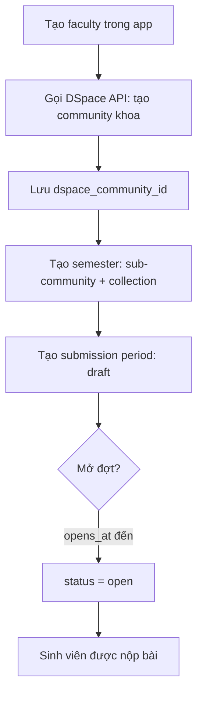
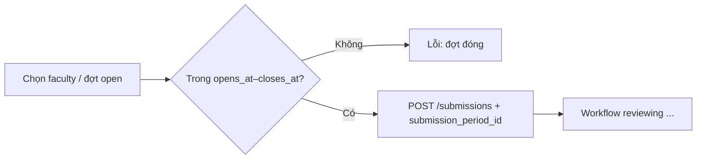

# Kho lưu chiểu theo khoa và đợt nộp bài (Faculty archives & submission periods)

Tài liệu thiết kế tính năng cho phép **`library_staff`** cấu hình cấu trúc lưu trữ theo **khoa** (faculty), **học kỳ** (semester), và **đợt nộp bài** (submission period) trước khi sinh viên nộp luận văn/luận án và trước khi bài được đẩy lên DSpace.

Tham chiếu: [`user-roles.md`](./user-roles.md), [`tai-lieu-thiet-ke-he-thong.md`](./tai-lieu-thiet-ke-he-thong.md), [`quy-dinh-nop-luu-chieu-thu-vien.md`](./quy-dinh-nop-luu-chieu-thu-vien.md).

**Trạng thái:** Đã triển khai (2026-05): chọn đợt nộp cho sinh viên, CRUD cấu hình khoa/học kỳ/đợt cho `library_staff` và `admin`, xem chỉ đọc cho `director`, provisioning DSpace (REST khi cấu hình `dspace_api_*` trong system settings, placeholder dev khi chưa cấu hình), publish item khi director phê duyệt.

---

## 1. Mục tiêu

| Mục tiêu | Mô tả |
| -------- | ----- |
| Tổ chức lưu trữ theo khoa | Mỗi khoa/đơn vị đào tạo có **community** riêng trên DSpace để lưu trữ lâu dài các bài đã duyệt. |
| Phân tách theo học kỳ | Dưới mỗi khoa, **sub-community** đại diện học kỳ (ví dụ `2025-1`, `2025-2`) để tra cứu và báo cáo theo thời gian. |
| Kiểm soát thời gian nộp | **`library_staff`** mở **đợt nộp** (submission period) cho từng khoa: sinh viên chỉ nộp được trong khoảng thời gian cho phép. |
| Liên kết nộp bài ↔ kho lưu trữ | Mỗi bài nộp gắn với một đợt (và do đó khoa + học kỳ); khi `approved`, hệ thống biết **collection** DSpace đích để tạo item. |

---

## 2. Khái niệm

### 2.1 Faculty (khoa)

Đơn vị đào tạo trong trường (ví dụ: Khoa Công nghệ thông tin, Khoa Cơ khí).

- Có mã khoa (`code`) duy nhất, tên hiển thị, trạng thái `active` / `inactive`.
- Map 1–1 với **DSpace community** cấp khoa (do `library_staff` tạo hoặc đồng bộ).

### 2.2 Semester sub-community (học kỳ)

Đại diện một học kỳ thuộc một khoa (ví dụ `2025-1` = học kỳ 1 năm 2025).

- Là **sub-community** con của community khoa trên DSpace.
- Dưới sub-community học kỳ có ít nhất một **collection** chứa item (luận văn/luận án) — collection là nơi backend tạo DSpace item khi publish.

### 2.3 Submission period (đợt nộp bài)

Khoảng thời gian và phạm vi nghiệp vụ mà sinh viên **được phép** tạo bài nộp mới cho một khoa.

| Thuộc tính (gợi ý) | Ý nghĩa |
| ------------------ | ------- |
| `faculty_id`       | Khoa áp dụng |
| `semester_id`      | Học kỳ mặc định cho bài nộp trong đợt (map sub-community / collection) |
| `name`             | Tên đợt (ví dụ: "Đợt nộp lưu chiểu HK1/2025–2026") |
| `opens_at`         | Thời điểm bắt đầu nhận nộp |
| `closes_at`        | Thời điểm kết thúc nhận nộp |
| `status`           | `draft`, `open`, `closed`, `archived` |
| `allow_resubmit`   | Cho phép nộp lại trong đợt khi bài `reject` (mặc định: có) |

**Quy tắc:**

- Chỉ đợt có `status = open` và `now()` ∈ [`opens_at`, `closes_at`] mới cho `POST /submissions`.
- Một khoa có thể có **nhiều đợt** theo thời gian (không chồng lấn `open` nếu chính sách “một đợt mở tại một thời điểm” — xem mục 6).
- Sinh viên chọn (hoặc hệ thống gán) đợt đang mở thuộc khoa của mình khi nộp bài.

---

## 3. Cấu trúc DSpace (mapping)

DSpace 7 phân cấp: **Community** → (sub-communities | collections) → **Collection** → **Item**.

### 3.1 Cây mục tiêu

```text
[Luu chieu LV/LA Truong DH]          ← community gốc (có sẵn trên DSpace, cấu hình một lần)
├── Khoa CNTT                        ← faculty community (library_staff tạo)
│   ├── 2025-1                       ← semester sub-community
│   │   └── Luat van - HK 2025-1     ← collection (chứa item)
│   └── 2025-2
│       └── Luat van - HK 2025-2
├── Khoa Co khi
│   └── 2024-2
│       └── Luan an - HK 2024-2
└── ...
```

### 3.2 Trách nhiệm từng lớp

| Lớp DSpace | Ai tạo | Vai trò |
| ---------- | ------ | ------- |
| Community gốc trường | `admin` / cấu hình hạ tầng | Container toàn trường |
| Community khoa | `library_staff` | Phân vùng theo đơn vị đào tạo |
| Sub-community học kỳ | `library_staff` | Phân vùng theo thời gian |
| Collection | `library_staff` (tự động khi tạo học kỳ hoặc thủ công) | Đích publish item đã `approved` |
| Item | Backend (job DSpace) | Một bài nộp đã duyệt |

### 3.3 Đồng bộ ID

Hệ thống web lưu bản sao metadata + khóa ngoại DSpace:

| Bảng app (dự kiến) | Trường DSpace |
| ------------------ | ------------- |
| `faculties` | `dspace_community_id` |
| `semesters` | `dspace_community_id` |
| `semesters` hoặc `archive_collections` | `dspace_collection_id` |

Nguyên tắc: **DSpace là nguồn lưu trữ tài liệu**; PostgreSQL giữ cấu hình nghiệp vụ, đợt nộp, và liên kết workflow ([`tai-lieu-thiet-ke-he-thong.md`](./tai-lieu-thiet-ke-he-thong.md)).

---

## 4. Actor và quyền

Chỉ **`library_staff`** (và **`admin`** override) được phép:

| Hành động | library_staff | admin | Khác |
| --------- | :-----------: | :---: | ---- |
| Tạo / sửa / ẩn faculty | ✓ | ✓ | — |
| Tạo community DSpace cho khoa | ✓ | ✓ | — |
| Tạo sub-community học kỳ + collection | ✓ | ✓ | — |
| Tạo / mở / đóng submission period | ✓ | ✓ | — |
| Xem cấu hình khoa & đợt | ✓ | ✓ | director (chỉ xem) |
| Chọn đợt khi nộp bài | — | — | student (đợt `open`) |

`director` không cấu hình cấu trúc kho; chỉ phê duyệt bài đã qua kiểm tra thư viện ([`user-roles.md`](./user-roles.md)).

---

## 5. Luồng nghiệp vụ

### 5.1 Thiết lập ban đầu (library_staff)



### 5.2 Sinh viên nộp bài



### 5.3 Publish lên DSpace (sau approve)

1. Đọc `submission.submission_period_id` → `semester` → `dspace_collection_id`.
2. Tạo item trong collection tương ứng.
3. Lưu `submissions.dspace_item_id`.

Nếu thiếu collection hoặc community đã xóa trên DSpace → job báo lỗi, `library_staff` xử lý thủ công.

---

## 6. Quy tắc nghiệp vụ

### 6.1 Faculty

- `code` duy nhất toàn hệ thống (ví dụ `CNTT`, `CK`).
- Không xóa cứng nếu đã có bài nộp; chỉ `inactive`.
- Tạo community DSpace: tên hiển thị = tên khoa; mô tả metadata tùy chọn.

### 6.2 Semester

- Gợi ý mã: `{year}-{term}` (`2025-1`, `2025-2`) hoặc `{year}-HK{term}`.
- Cặp `(faculty_id, code)` duy nhất.
- Khi tạo semester, hệ thống **nên** tự tạo collection mặc định (tên: `Luận văn – {semester code}`) trừ khi staff chọn template khác.

### 6.3 Submission period

| Quy tắc | Chi tiết |
| ------- | -------- |
| Thời gian | `opens_at` < `closes_at`; timezone: `Asia/Ho_Chi_Minh` (cấu hình server). |
| Trạng thái | `draft` → `open` (thủ công hoặc cron) → `closed` (hết hạn hoặc đóng tay) → `archived` (lưu trữ cấu hình). |
| Một đợt mở / khoa | Khuyến nghị: tối đa **một** period `open` cho mỗi `faculty_id` tại một thời điểm (tránh sinh viên chọn nhầm). Có thể nới khi khoa chạy song song đợt Thạc sĩ / Tiến sĩ (thêm trường `program` sau). |
| Đóng đợt | Không chặn bài đang `reviewing` / `approving`; chỉ chặn **tạo mới** và có thể chặn **resubmit** nếu `allow_resubmit = false`. |
| Gắn semester | Mỗi period bắt buộc `semester_id` để xác định collection publish. |

### 6.4 Liên kết sinh viên – khoa

Giai đoạn 1 (đơn giản): profile `users` thêm `faculty_id` (nullable); form nộp chỉ hiện đợt `open` của khoa đó.

Giai đoạn 2: SSO/LMS đồng bộ mã khoa từ hệ thống đào tạo.

---

## 7. Mô hình dữ liệu (dự kiến)

### 7.1 Bảng mới

```sql
-- faculties: khoa + community DSpace
CREATE TABLE faculties (
  id UUID PRIMARY KEY,
  code TEXT NOT NULL UNIQUE,
  name TEXT NOT NULL,
  dspace_community_id TEXT,
  status TEXT NOT NULL DEFAULT 'active'
    CHECK (status IN ('active', 'inactive')),
  created_by TEXT REFERENCES users(id),
  created_at TIMESTAMPTZ NOT NULL DEFAULT NOW(),
  updated_at TIMESTAMPTZ NOT NULL DEFAULT NOW()
);

-- semesters: học kỳ = sub-community + collection
CREATE TABLE semesters (
  id UUID PRIMARY KEY,
  faculty_id UUID NOT NULL REFERENCES faculties(id),
  code TEXT NOT NULL,
  name TEXT NOT NULL,
  dspace_community_id TEXT,
  dspace_collection_id TEXT NOT NULL,
  status TEXT NOT NULL DEFAULT 'active'
    CHECK (status IN ('active', 'inactive')),
  created_by TEXT REFERENCES users(id),
  created_at TIMESTAMPTZ NOT NULL DEFAULT NOW(),
  UNIQUE (faculty_id, code)
);

-- submission_periods: đợt nộp theo khoa
CREATE TABLE submission_periods (
  id UUID PRIMARY KEY,
  faculty_id UUID NOT NULL REFERENCES faculties(id),
  semester_id UUID NOT NULL REFERENCES semesters(id),
  name TEXT NOT NULL,
  opens_at TIMESTAMPTZ NOT NULL,
  closes_at TIMESTAMPTZ NOT NULL,
  status TEXT NOT NULL DEFAULT 'draft'
    CHECK (status IN ('draft', 'open', 'closed', 'archived')),
  allow_resubmit BOOLEAN NOT NULL DEFAULT TRUE,
  created_by TEXT REFERENCES users(id),
  created_at TIMESTAMPTZ NOT NULL DEFAULT NOW(),
  updated_at TIMESTAMPTZ NOT NULL DEFAULT NOW(),
  CHECK (opens_at < closes_at)
);
```

### 7.2 Mở rộng bảng hiện có

```sql
ALTER TABLE users ADD COLUMN IF NOT EXISTS faculty_id UUID REFERENCES faculties(id);

ALTER TABLE submissions ADD COLUMN IF NOT EXISTS submission_period_id UUID
  REFERENCES submission_periods(id);
```

### 7.3 Sự kiện audit (gợi ý)

Ghi vào `submission_events` hoặc bảng `archive_config_events`:

- `faculty_created`, `semester_created`, `period_opened`, `period_closed`

---

## 8. API (dự kiến)

Base: `/api/archive-config` (hoặc tách module `faculties`, `semesters`, `periods`). Tất cả endpoint ghi yêu cầu JWT + role `library_staff` (hoặc `admin`).

| Method | Endpoint | Mô tả |
| ------ | -------- | ----- |
| `GET` | `/faculties` | Danh sách khoa |
| `POST` | `/faculties` | Tạo khoa + (tùy chọn) provisioning DSpace community |
| `PATCH` | `/faculties/:id` | Sửa tên, trạng thái |
| `GET` | `/faculties/:id/semesters` | Học kỳ của khoa |
| `POST` | `/faculties/:id/semesters` | Tạo học kỳ + sub-community + collection trên DSpace |
| `GET` | `/faculties/:id/submission-periods` | Đợt nộp theo khoa |
| `POST` | `/faculties/:id/submission-periods` | Tạo đợt (`draft`) |
| `POST` | `/submission-periods/:id/open` | Mở đợt (`status = open`) |
| `POST` | `/submission-periods/:id/close` | Đóng đợt sớm |
| `GET` | `/submission-periods/open` | Đợt đang mở (query `facultyId` — dùng cho form sinh viên) |

**Validation khi tạo submission (bổ sung `POST /submissions`):**

- `submissionPeriodId` bắt buộc.
- Period thuộc `faculty` trùng `users.faculty_id` (hoặc cho phép chọn khoa nếu chưa gắn).
- Period `open` và trong khoảng thời gian.

---

## 9. Giao diện (library_staff)

### 9.1 Màn hình “Cấu hình lưu trữ khoa”

- Bảng khoa: mã, tên, trạng thái, link DSpace community, số học kỳ, đợt đang mở.
- Nút **Thêm khoa** → form (code, name) → sau lưu: “Tạo trên DSpace” / tự động.

### 9.2 Chi tiết khoa

- Tab **Học kỳ:** danh sách semester, nút **Thêm học kỳ** (code, name, tên collection).
- Tab **Đợt nộp:** bảng period (tên, học kỳ, mở–đóng, trạng thái), **Tạo đợt**, **Mở** / **Đóng**.

### 9.3 Màn hình sinh viên (bổ sung)

- Trước form nộp: chọn **Đợt nộp** (dropdown chỉ đợt `open` thuộc khoa).
- Hiển thị cảnh báo nếu không có đợt mở.

---

## 10. Tích hợp workflow hiện tại

| Giai đoạn hiện tại | Thay đổi khi bật tính năng |
| ------------------ | --------------------------- |
| Student nộp → `reviewing` | Thêm `submission_period_id`; validate đợt mở |
| Reviewer / admin duyệt | Không đổi logic trạng thái |
| `approved` → DSpace | Item tạo trong `semesters.dspace_collection_id` của period |
| Resubmit | Kiểm tra `allow_resubmit` và period vẫn `open` (hoặc giữ period gốc của bài) |

---

## 11. Lỗi và xử lý

| Tình huống | Hành vi |
| ---------- | ------- |
| DSpace API lỗi khi tạo community | Lưu faculty ở trạng thái `pending_dspace`; staff retry |
| Đợt hết hạn khi SV đang soạn form | Submit trả 400: “Đợt nộp đã đóng” |
| Collection bị xóa trên DSpace | Publish job fail; cảnh báo cho `library_staff` |
| Khoa `inactive` | Không tạo period mới; đợt cũ có thể đóng dần |

---

## 12. Kế hoạch triển khai gợi ý

| Phase | Nội dung | Phụ thuộc |
| ----- | -------- | --------- |
| P1 | Bảng `faculties`, `semesters`, CRUD + UI library_staff (chưa DSpace) | Role `library_staff` |
| P2 | Tích hợp DSpace REST: tạo community / sub-community / collection | Sprint 4 DSpace |
| P3 | `submission_periods` + validate `POST /submissions` | P1 |
| P4 | Gắn `faculty_id` user + form chọn đợt | P3 |
| P5 | Publish item theo `dspace_collection_id` | P2 + workflow `approved` |

---

## 13. Tiêu chí nghiệm thu

- [x] `library_staff` tạo được khoa và thấy `dspace_community_id` (hoặc trạng thái chờ đồng bộ).
- [x] Tạo được học kỳ dưới khoa với sub-community + collection trên DSpace (dev placeholder hoặc REST thật).
- [x] Tạo và mở đợt nộp; sinh viên chỉ nộp được trong khoảng thời gian cho phép.
- [x] Bài `approved` được gán `dspace_item_id` theo collection của học kỳ/đợt.
- [x] Đóng đợt không xóa dữ liệu bài đã nộp; chặn nộp mới đúng quy tắc.

### API đã triển khai

| Method | Endpoint | Role |
| ------ | -------- | ---- |
| `GET` | `/api/archive/faculties` | `student` — khoa có đợt mở |
| `GET` | `/api/archive/faculties/:id/semesters` | `student` |
| `GET` | `/api/archive/submission-periods?facultyId=&semesterId=` | `student` |
| `GET` | `/api/archive-config/universities` | `library_staff`, `admin`, `director` |
| `GET` | `/api/archive-config/faculties` | `library_staff`, `admin`, `director` |
| `POST` | `/api/archive-config/faculties` | `library_staff`, `admin` |
| `PATCH` | `/api/archive-config/faculties/:id` | `library_staff`, `admin` |
| `POST` | `/api/archive-config/faculties/:id/provision-dspace` | `library_staff`, `admin` |
| `GET` | `/api/archive-config/faculties/:id/semesters` | `library_staff`, `admin`, `director` |
| `POST` | `/api/archive-config/faculties/:id/semesters` | `library_staff`, `admin` |
| `GET` | `/api/archive-config/faculties/:id/submission-periods` | `library_staff`, `admin`, `director` |
| `POST` | `/api/archive-config/faculties/:id/submission-periods` | `library_staff`, `admin` |
| `POST` | `/api/archive-config/submission-periods/:id/open` | `library_staff`, `admin` |
| `POST` | `/api/archive-config/submission-periods/:id/close` | `library_staff`, `admin` |

---

## 14. Tài liệu liên quan

- Vai trò: [`user-roles.md`](./user-roles.md)
- API submissions hiện tại: [`api/post-submissions.md`](./api/post-submissions.md)
- Checklist sprint DSpace: [`checklist.md`](./checklist.md) — Sprint 4
