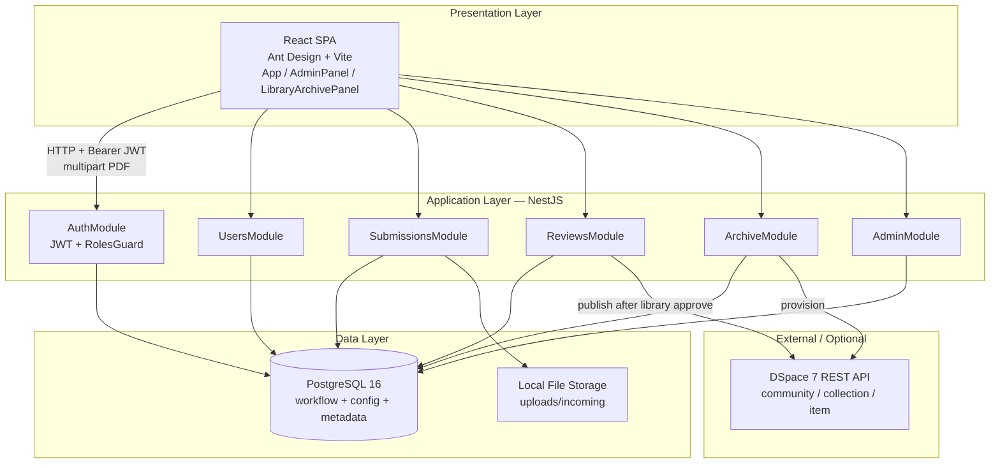
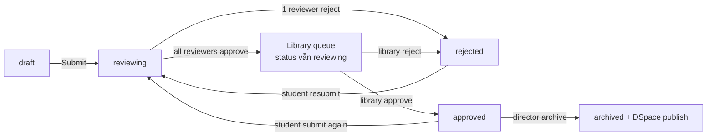
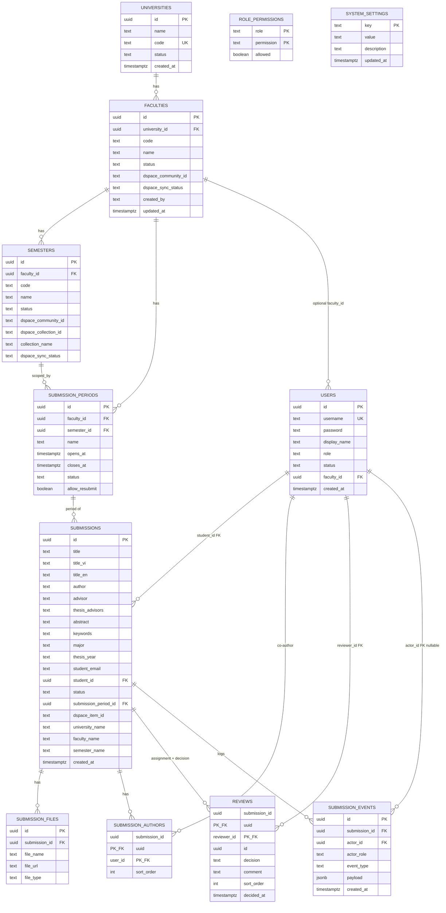
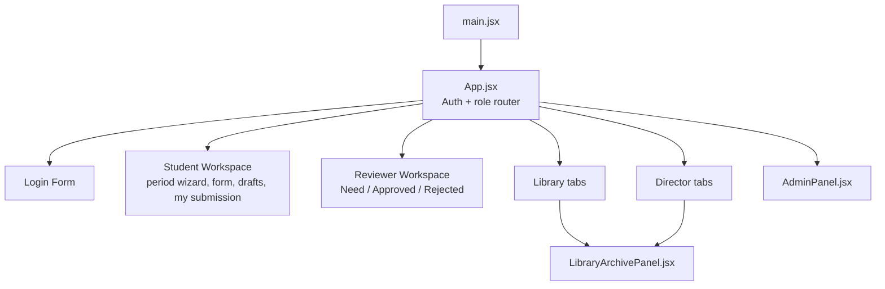
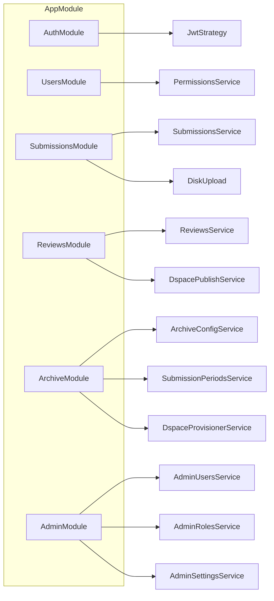
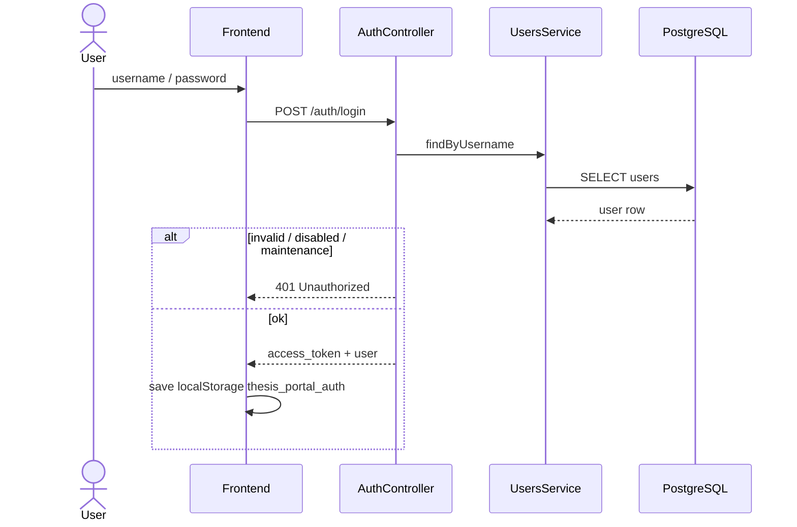
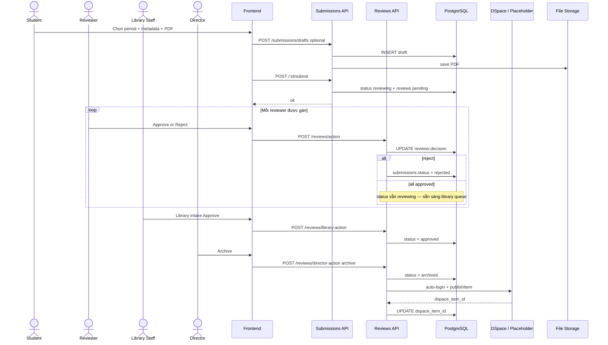
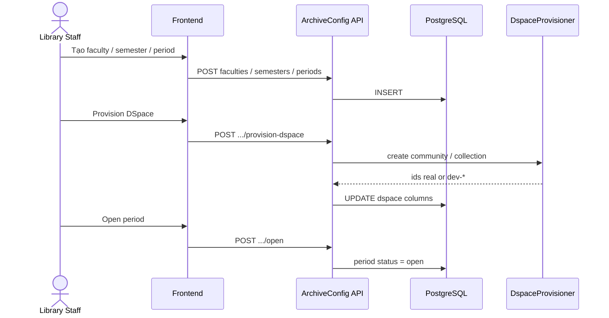
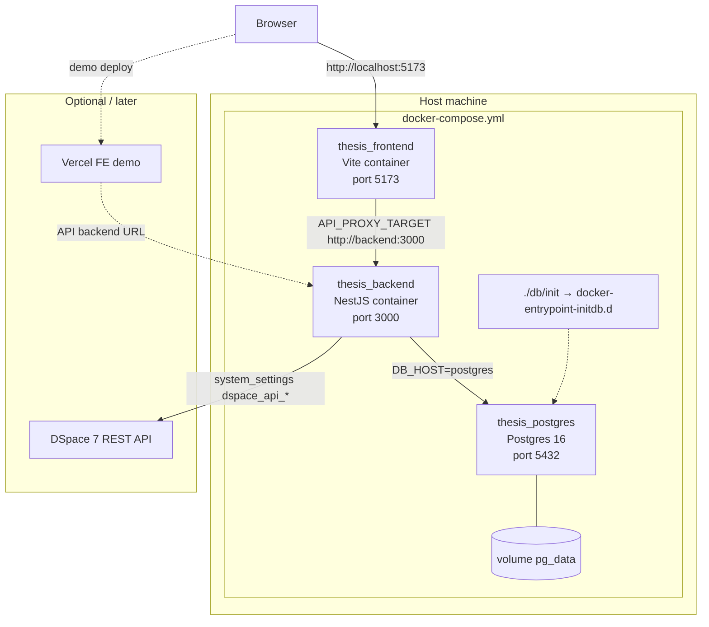

# Thiết kế chi tiết hệ thống

## Thesis Deposit Portal — nộp lưu chiểu luận văn/luận án tích hợp DSpace

Tài liệu này mô tả kiến trúc và thiết kế theo **trạng thái triển khai hiện tại** trong mã nguồn.  
Tham chiếu: [`huong-dan-su-dung-theo-vai-tro.md`](./huong-dan-su-dung-theo-vai-tro.md), [`user-roles.md`](./user-roles.md), [`faculty-archives-and-submission-periods.md`](./faculty-archives-and-submission-periods.md).

> **Lưu ý:** [`tai-lieu-thiet-ke-he-thong.md`](./tai-lieu-thiet-ke-he-thong.md) còn phản ánh mô hình cũ (3 vai trò, status `approving`/`reject`). Khi có xung đột, lấy tài liệu này và code làm chuẩn.

---

## 1. System Architecture

### 1.1 Kiến trúc tổng thể



### 1.2 Nguyên tắc thiết kế

| Nguyên tắc | Mô tả |
| ---------- | ----- |
| Tách lớp | Frontend chỉ gọi REST NestJS; không gọi DSpace trực tiếp |
| Workflow trong Postgres | Trạng thái bài nộp, review, events, đợt nộp lưu ở PostgreSQL |
| DSpace là kho lưu trữ | Khi cấu hình `dspace_api_*`, backend provision community/collection và publish item |
| Phân quyền theo role | JWT chứa `role`; guard `@Roles()` bảo vệ endpoint |
| File tạm local | PDF lưu `uploads/incoming` cho tới khi (hoặc song song với) publish DSpace |

### 1.3 Vai trò người dùng

| Role | Nhiệm vụ |
| ---- | -------- |
| `student` | Nháp / nộp / nộp lại; chọn đợt, tác giả, reviewer |
| `reviewer` | Duyệt học thuật trên bài được gán |
| `library_staff` | Intake sau khi mọi reviewer approve; cấu hình archive |
| `director` | Archive bài `approved` → `archived` |
| `admin` | Users / roles / system settings — không duyệt luận văn |

### 1.4 Workflow trạng thái



Trạng thái hợp lệ: `draft` | `reviewing` | `approved` | `rejected` | `archived`.

---

## 2. Database Design (ERD)

### 2.1 Sơ đồ thực thể quan hệ



### 2.2 Enum và ràng buộc

| Trường | Giá trị |
| ------ | ------- |
| `users.role` | `student`, `reviewer`, `library_staff`, `director`, `admin` |
| `users.status` | `active`, `disabled` |
| `submissions.status` | `draft`, `reviewing`, `approved`, `rejected`, `archived` |
| `reviews.decision` | `pending`, `approved`, `reject` |
| `submission_periods.status` | `draft`, `open`, `closed`, `archived` |
| `faculties/semesters.dspace_sync_status` | `pending`, `synced`, `failed` |

**Ràng buộc nghiệp vụ nổi bật**

- `submissions.student_id` → `users(id)` (UUID FK); đã bỏ `advisor_id` legacy.
- `submission_events.actor_id` → `users(id)` (nullable FK).
- `reviews` là nguồn sự thật cho **gán reviewer + quyết định** (`decision`, `sort_order`); bảng `submission_reviewers` đã gỡ.
- Mỗi sinh viên tối đa **một** submission không ở trạng thái `draft` (`idx_submissions_one_active_per_student`).
- Mỗi sinh viên tối đa **một** `draft` (`idx_submissions_one_draft_per_student`); Save draft upsert; Submit chuyển draft → `reviewing`.
- **Submitter** (người tạo/nộp) là người duy nhất được edit / draft / submit / resubmit bài đó. Đồng tác giả thấy bài (kể cả draft) trong My submissions nhưng chỉ **Detail** — không tạo draft/edit/nộp thesis khác; form không autofill từ bài đồng tác giả.
- Khi submit: hệ thống **xóa draft** của mọi author trong danh sách (trừ chính submission đang nộp).
- Sinh viên đã là submitter hoặc author trên bài không-draft thì không được tạo/giữ draft riêng.
- Tối đa **một** đợt `open` mỗi khoa (`idx_one_open_period_per_faculty`).
- Bài không-draft: submitter phải có trong `submission_authors` (constraint trigger `trg_submitter_is_author`, deferred).
- Index: `submissions(status)`, `submissions(student_id)`, `submissions(submission_period_id)`, `reviews(reviewer_id, decision)`.
- File luận văn: PDF, tối đa 30 MB (`thesis_max_file_size_mb`).

### 2.3 Nguồn schema

Script khởi tạo: `db/init/001_schema.sql` … `028_one_draft_per_student.sql`.

**DB hiện có:** chạy migration `026` trên Postgres, hoặc `docker compose down -v && docker compose up --build` để init lại.

---

## 3. API Design

**Base URL (local):** `http://localhost:3000`  
**Auth header:** `Authorization: Bearer <access_token>` (trừ login / health / root)

### 3.1 Auth và hệ thống

| Method | Path | Role | Mô tả |
| ------ | ---- | ---- | ----- |
| GET | `/` | public | Root info |
| GET | `/health` | public | Health check |
| POST | `/auth/login` | public | `{ username, password }` → JWT + user |

### 3.2 Users

| Method | Path | Role | Mô tả |
| ------ | ---- | ---- | ----- |
| GET | `/users?role=` | authenticated | Dropdown theo role (`student`, `reviewer`, …) |

### 3.3 Submissions

| Method | Path | Role | Mô tả |
| ------ | ---- | ---- | ----- |
| POST | `/submissions` | student | Nộp mới (multipart) |
| POST | `/submissions/drafts` | student | Lưu nháp |
| PATCH | `/submissions/:submissionId` | student | Cập nhật nháp |
| POST | `/submissions/:submissionId/submit` | student | Submit / resubmit |
| POST | `/submissions/:submissionId/revert-to-draft` | student | Về nháp (điều kiện) |
| DELETE | `/submissions/:submissionId` | student | Xóa (điều kiện) |
| GET | `/submissions` | library_staff, director | Tất cả bài nộp |
| GET | `/submissions/student/:studentId` | student\*, library_staff, director | Bài theo sinh viên |
| GET | `/submissions/:submissionId/files/:fileId/download` | student, reviewer, library_staff, director | Tải / xem PDF |

\*Student chỉ xem khi `:studentId` = chính mình.

**Multipart fields (tóm tắt):** `studentId`, `authorIds` (JSON), `reviewerIds` (JSON), `submissionPeriodId`, metadata (`titleVi`, `titleEn`, `thesisAdvisors`, `major`, `thesisYear`, `abstract`, `keywords`, …), `thesisFile`.

### 3.4 Reviews

| Method | Path | Role | Body / ghi chú |
| ------ | ---- | ---- | -------------- |
| GET | `/reviews/my-queue` | reviewer | Hàng đợi gán cho reviewer |
| POST | `/reviews/action` | reviewer | `{ submissionId, action: "approve"\|"reject", comment? }` — reject bắt buộc comment |
| GET | `/reviews/library-queue` | library_staff | Bài ready intake (mọi reviewer approved, status vẫn `reviewing`) |
| POST | `/reviews/library-action` | library_staff | approve → `approved` (+ publish DSpace best-effort); reject → `rejected` |
| GET | `/reviews/director-queue` | director | `status = approved` |
| POST | `/reviews/director-action` | director | `{ submissionId, action: "archive" }` → `archived` |

### 3.5 Archive (sinh viên chọn đợt nộp)

| Method | Path | Role |
| ------ | ---- | ---- |
| GET | `/archive/faculties` | student |
| GET | `/archive/faculties/:facultyId/semesters` | student |
| GET | `/archive/submission-periods?facultyId=&semesterId=` | student |

### 3.6 Archive config

| Method | Path | Role ghi |
| ------ | ---- | -------- |
| GET | `/archive-config/universities` | library_staff, admin, director |
| GET | `/archive-config/faculties` | library_staff, admin, director |
| POST | `/archive-config/faculties` | library_staff, admin |
| PATCH | `/archive-config/faculties/:facultyId` | library_staff, admin |
| POST | `/archive-config/faculties/:facultyId/provision-dspace` | library_staff, admin |
| POST | `/archive-config/dspace/sync-from-root` | library_staff, admin | Map DSpace root→khoa→HK→đợt theo tên |
| GET/POST | `/archive-config/faculties/:facultyId/semesters` | GET: +director; POST: library_staff, admin |
| GET/POST | `/archive-config/faculties/:facultyId/submission-periods` | tương tự |
| POST | `/archive-config/submission-periods/:periodId/open` | library_staff, admin |
| POST | `/archive-config/submission-periods/:periodId/close` | library_staff, admin |

### 3.7 Admin

| Method | Path | Role |
| ------ | ---- | ---- |
| GET | `/admin/users` | admin |
| POST | `/admin/users` | admin |
| PATCH | `/admin/users/:userId` | admin |
| GET | `/admin/roles` | admin |
| GET | `/admin/roles/meta` | admin |
| PUT | `/admin/roles/:role` | admin |
| GET | `/admin/settings` | admin |
| PATCH | `/admin/settings` | admin |

Chi tiết từng endpoint (một phần): [`api/README.md`](./api/README.md).

### 3.8 Phân quyền theo permission (DB-driven)

API bảo vệ bằng `JwtAuthGuard` + `PermissionsGuard` và decorator `@RequirePermissions(...)`.  
Guard đọc bảng `role_permissions` (cache ~30s; invalidate khi admin cập nhật roles).

| Permission | Endpoint điển hình |
| ---------- | ------------------ |
| `submit_thesis` | Nộp/nháp, `/archive/*` (student), `GET /users` |
| `review_academic` | `/reviews/my-queue`, `/reviews/action` |
| `library_intake` | `/reviews/library-*`, ghi `/archive-config` |
| `director_approval` | `/reviews/director-*` |
| `view_all_submissions` | `GET /submissions`, đọc archive-config |
| `manage_users` / `manage_roles` / `configure_system` | `/admin/*` |

User cần **ít nhất một** permission trong danh sách decorator (OR).

---

## 4. Component Design

### 4.1 Frontend



| Component | File | Trách nhiệm |
| --------- | ---- | ----------- |
| Bootstrap | `frontend/src/main.jsx` | Mount React app |
| App shell | `frontend/src/App.jsx` | Auth localStorage, gọi API, dashboard theo role, form nộp bài, review UI |
| Admin | `frontend/src/AdminPanel.jsx` | Manage users, roles, system settings |
| Archive UI | `frontend/src/LibraryArchivePanel.jsx` | Universities / faculties / semesters / periods |

### 4.2 Backend (NestJS)



| Lớp | Thành phần | Vai trò |
| --- | ---------- | ------- |
| Controller | `*.controller.ts` | HTTP routing, `@RequirePermissions`, multipart |
| Service | `*.service.ts` | Nghiệp vụ + SQL (`pg` pool) |
| DTO | `dto/*.dto.ts` | Validate input (class-validator) |
| Guard | `JwtAuthGuard`, `PermissionsGuard` | JWT + quyền từ `role_permissions` |
| Permissions | `PermissionsService` | Cache / invalidate quyền theo role |
| Integration | `DspaceProvisionerService`, `DspacePublishService` | Community/collection/item DSpace hoặc placeholder `dev-*` |

### 4.3 Permissions (logic admin)

| Permission | Ý nghĩa |
| ---------- | ------- |
| `submit_thesis` | Nộp luận văn |
| `review_academic` | Phản biện học thuật |
| `library_intake` | Tiếp nhận thư viện |
| `director_approval` | Archive cấp giám đốc |
| `view_all_submissions` | Xem mọi bài nộp |
| `manage_users` | Quản lý user |
| `manage_roles` | Quản lý quyền role |
| `configure_system` | Cấu hình hệ thống |

Guard API hiện gắn cứng theo `@Roles(...)`; bảng `role_permissions` phục vụ cấu hình UI admin.

---

## 5. Sequence Diagram

### 5.1 Đăng nhập



### 5.2 Nộp bài → phản biện → thư viện → giám đốc



### 5.3 Cấu hình đợt nộp và provision DSpace



---

## 6. Deployment Diagram

### 6.1 Môi trường Docker Compose (local)



### 6.2 Mapping service

| Service | Build / Image | Port | Phụ thuộc | Biến môi trường chính |
| ------- | ------------- | ---- | --------- | --------------------- |
| `postgres` | `postgres:16` | 5432 | volume `pg_data`, SQL init | `POSTGRES_DB`, `POSTGRES_USER`, `POSTGRES_PASSWORD` |
| `backend` | `./backend` Dockerfile | 3000 | postgres | `DB_HOST=postgres`, `JWT_SECRET`, `PORT` |
| `frontend` | `./frontend` Dockerfile | 5173 | backend | `API_PROXY_TARGET=http://backend:3000` |

### 6.3 Khởi chạy

```bash
docker compose up --build
```

- Frontend: `http://localhost:5173`
- Backend: `http://localhost:3000`
- Reset DB (chạy lại init SQL): `docker compose down -v && docker compose up --build`

### 6.4 Ghi chú vận hành

- DSpace: cấu hình `dspace_api_base_url` + `dspace_api_user` / `dspace_api_password` (auto-login). `dspace_api_token` chỉ là fallback. Director **Archive** publish item; có thể set env `DSPACE_API_*` trong `docker-compose.yml`.
- Upload PDF nằm trong filesystem container backend — production nên gắn volume riêng hoặc chuyển object storage / DSpace bitstream.
- Tài khoản demo: xem [`huong-dan-su-dung-theo-vai-tro.md`](./huong-dan-su-dung-theo-vai-tro.md).

---

## 7. Công nghệ sử dụng

| Lớp | Công nghệ |
| --- | --------- |
| Frontend | React 18, Ant Design 5, Vite 6 |
| Backend | NestJS 10, Passport JWT, Multer, class-validator, `pg` |
| Database | PostgreSQL 16 |
| Deploy local | Docker Compose |
| Kho học thuật | DSpace 7 REST (tùy cấu hình) |

---

## 8. Liên kết tài liệu liên quan

| Tài liệu | Nội dung |
| -------- | -------- |
| [`huong-dan-su-dung-theo-vai-tro.md`](./huong-dan-su-dung-theo-vai-tro.md) | Hướng dẫn sử dụng theo từng role |
| [`user-roles.md`](./user-roles.md) | Mô tả vai trò (cần đồng bộ với workflow rút gọn) |
| [`faculty-archives-and-submission-periods.md`](./faculty-archives-and-submission-periods.md) | Khoa / học kỳ / đợt nộp |
| [`huong-dan-kiem-tra-archive-dspace.md`](./huong-dan-kiem-tra-archive-dspace.md) | Sau Director Archive: kiểm tra Portal API + DSpace API |
| [`api/README.md`](./api/README.md) | Tài liệu API (một phần endpoint) |
| [`checklist.md`](./checklist.md) | Checklist sprint |
| [`../README.md`](../README.md) | Quick start |
