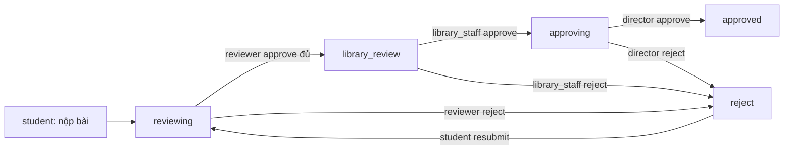

# Vai trò người dùng (User roles)

Tài liệu mô tả năm vai trò trong hệ thống web nộp lưu chiểu luận văn/luận án tích hợp thư viện. Mỗi tài khoản có đúng **một** vai trò; vai trò được lưu trong cột `users.role` và đưa vào JWT sau khi đăng nhập.

Tham chiếu: [`tai-lieu-thiet-ke-he-thong.md`](./tai-lieu-thiet-ke-he-thong.md), [`quy-dinh-nop-luu-chieu-thu-vien.md`](./quy-dinh-nop-luu-chieu-thu-vien.md), [`faculty-archives-and-submission-periods.md`](./faculty-archives-and-submission-periods.md).

---

## 1. Danh sách vai trò

| Giá trị `role`   | Tên hiển thị (gợi ý)     | Đối tượng thực tế                          |
| ---------------- | ------------------------ | ------------------------------------------ |
| `student`        | Sinh viên / NCS          | Học viên, nghiên cứu sinh nộp bài          |
| `reviewer`       | Phản biện / CB hướng dẫn | Giảng viên được gán duyệt nội dung học thuật |
| `library_staff`  | Cán bộ thư viện          | Bộ phận tiếp nhận, kiểm tra định dạng nộp lưu chiểu |
| `director`       | Giám đốc thư viện      | Người phê duyệt cuối trước khi lưu trữ/công bố |
| `admin`          | Quản trị hệ thống        | Vận hành kỹ thuật, quản lý tài khoản, giám sát toàn hệ thống |

**Quy ước mã:** dùng chữ thường, snake_case (`library_staff`), khớp với giá trị lưu DB và claim JWT.

---

## 2. Mô tả từng vai trò

### 2.1 `student` — Sinh viên

**Mục đích:** Người nộp luận văn/luận án và theo dõi tiến trình bài của mình.

**Trách nhiệm chính:**

- Nhập metadata: tiêu đề, tóm tắt, từ khóa.
- Chọn tác giả (tài khoản `student`) và người phản biện (tài khoản `reviewer`).
- Tải lên file PDF luận văn và phụ lục (nếu có).
- Gửi bài; xem lịch sử trạng thái và sự kiện workflow.
- **Nộp lại** khi bài ở trạng thái `reject` (chỉnh metadata/file rồi gửi duyệt lại).

**Quyền hệ thống:**

| Hành động                         | Cho phép |
| --------------------------------- | -------- |
| `POST /submissions`               | Có (chỉ với `studentId` = chính mình) |
| `PUT /submissions/:id/resubmit`   | Có (chỉ bài thuộc về mình) |
| `GET /submissions/student/:id`    | Có (chỉ `:id` = chính mình) |
| `GET /users?role=student`         | Có (chọn đồng tác giả) |
| `GET /users?role=reviewer`        | Có (chọn phản biện) |
| Duyệt bài của người khác          | Không |

**Giao diện:** Form nộp bài, bảng “My Submissions”, modal nộp lại.

---

### 2.2 `reviewer` — Phản biện

**Mục đích:** Đánh giá **nội dung học thuật** sau khi sinh viên nộp bài (tương ứng cán bộ hướng dẫn / hội đồng trong quy trình thực tế).

**Trách nhiệm chính:**

- Xem hàng đợi các bài được gán (`submission_reviewers`).
- Phê duyệt hoặc từ chối kèm lý do (bắt buộc khi từ chối).
- Mỗi bài có thể có nhiều reviewer; khi **tất cả** approve → bài chuyển sang `library_review`; **một** reviewer reject → bài `reject`.

**Quyền hệ thống:**

| Hành động                    | Cho phép |
| ---------------------------- | -------- |
| `GET /reviews/my-queue`      | Có |
| `POST /reviews/action`       | Có (chỉ bài được gán, trạng thái `reviewing`) |
| Nộp bài thay sinh viên       | Không |
| Duyệt bước thư viện / giám đốc | Không |

**Giao diện:** Reviewer workspace (Need My Review / Approved / Rejected).

---

### 2.3 `library_staff` — Cán bộ thư viện

**Mục đích:** Tiếp nhận và **kiểm tra định dạng, hồ sơ nộp lưu chiểu** theo quy định thư viện (PDF, checklist, metadata, phụ lục) — tương ứng mục hỗ trợ kiểm tra định dạng trong [`quy-dinh-nop-luu-chieu-thu-vien.md`](./quy-dinh-nop-luu-chieu-thu-vien.md).

**Trách nhiệm chính:**

- **Cấu hình lưu trữ theo khoa** (dự kiến): community DSpace, sub-community học kỳ, đợt nộp — xem [`faculty-archives-and-submission-periods.md`](./faculty-archives-and-submission-periods.md).
- Xử lý hàng đợi bài ở trạng thái `library_review` sau khi reviewer hoàn tất.
- Xác nhận đủ file (PDF toàn văn, tóm tắt nếu áp dụng, phụ lục).
- Approve → chuyển `approving` (chờ giám đốc); reject → `reject`.

**Quyền hệ thống:**

| Hành động                              | Cho phép |
| -------------------------------------- | -------- |
| `GET /reviews/library-queue`           | Có |
| `POST /reviews/library-action`         | Có (trạng thái `library_review`) |
| `GET /submissions` (toàn bộ)           | Có |
| Tải file đính kèm bài nộp              | Có |
| `GET /users?role=...`                  | Không (chỉ student/reviewer trên form nộp) |
| Phê duyệt cuối (`approving` → `approved`) | Không |

**Giao diện:** Library intake queue, bảng all submissions.

---

### 2.4 `director` — Giám đốc thư viện

**Mục đích:** **Phê duyệt cuối cùng về mặt nghiệp vụ thư viện** trước khi bài được coi là sẵn sàng lưu trữ/công bố (DSpace).

**Trách nhiệm chính:**

- Xem bài ở trạng thái `approving` (đã qua library intake).
- Quyết định approve / reject cấp thư viện.
- Approve → `approved` (sẵn sàng tích hợp DSpace).

**Quyền hệ thống:**

| Hành động                         | Cho phép |
| --------------------------------- | -------- |
| `GET /reviews/director-queue`     | Có |
| `POST /reviews/director-action`   | Có (trạng thái `approving`) |
| `GET /submissions` (toàn bộ)       | Có |
| Tải file đính kèm                  | Có |
| Cấu hình hệ thống, seed user       | Không |

**Giao diện:** Director approval queue, bảng all submissions.

---

### 2.5 `admin` — Quản trị hệ thống

**Mục đích:** Vận hành hệ thống — **không** tham gia duyệt luận văn (không approve/reject bài nộp).

**Trách nhiệm chính (use cases 4.4.5.x):**

| Use case | Mô tả |
| -------- | ----- |
| **4.4.5.1 Manage users** | Tạo, sửa, vô hiệu hóa (`disabled`) tài khoản |
| **4.4.5.2 Manage roles** | Cấu hình quyền (permissions) theo từng role |
| **4.4.5.3 Configure system** | Cập nhật tham số hệ thống (kích thước file, timezone, maintenance mode, …) |

**Quyền hệ thống:**

| Hành động | Cho phép |
| --------- | -------- |
| `GET/POST/PATCH /admin/users` | Có |
| `GET/PUT /admin/roles/:role` | Có |
| `GET/PATCH /admin/settings` | Có |
| Duyệt bài / hàng đợi review | **Không** |
| `GET /submissions` | **Không** |

**Giao diện:** Tab Manage users · Manage roles · System settings (`AdminPanel`).

---

## 3. Luồng workflow và vai trò

### 3.1 Trạng thái bài nộp (`submissions.status`)

| Trạng thái        | Ý nghĩa |
| ----------------- | ------- |
| `reviewing`       | Đang chờ reviewer |
| `library_review`  | Đã qua reviewer; chờ cán bộ thư viện kiểm tra hồ sơ |
| `approving`       | Đã qua library_staff; chờ giám đốc phê duyệt cuối |
| `approved`        | Được chấp nhận; sẵn sàng tích hợp DSpace |
| `reject`          | Bị từ chối; sinh viên có thể nộp lại |

### 3.2 Luồng hiện tại (đã triển khai)

**Ghi chú:** Bài đang ở `approving` trước khi nâng cấp workflow vẫn hợp lệ và do `director` (hoặc `admin`) xử lý.

---

## 4. Ma trận quyền tóm tắt

| Khả năng                              | student | reviewer | library_staff | director | admin |
| ------------------------------------- | :-----: | :------: | :-----------: | :------: | :---: |
| Nộp / nộp lại bài                     | ✓       |          |               |          |       |
| Duyệt học thuật (`reviewing`)         |         | ✓        |               |          |       |
| Kiểm tra hồ sơ (`library_review`)     |         |          | ✓             |          |       |
| Phê duyệt cuối (`approving`)          |         |          |               | ✓        |       |
| Xem mọi bài nộp                       |         |          | ✓             | ✓        |       |
| Quản lý users / roles / cấu hình      |         |          |               |          | ✓     |
| Cấu hình khoa, học kỳ, đợt nộp       |         |          | (dự kiến)     |          |       |
| Được chọn làm tác giả trên form       | ✓       |          |               |          |       |
| Được chọn làm reviewer trên form      |         | ✓        |               |          |       |

---

## 5. API và dữ liệu liên quan

- Đăng nhập: `POST /auth/login` — response `user.role` là một trong năm giá trị trên.
- Liệt kê user theo vai trò: `GET /users?role=...` — `student`, `reviewer`, `library_staff`, `director`, `admin`.
- Ràng buộc DB: `CHECK (role IN ('student', 'reviewer', 'library_staff', 'director', 'admin'))` — migration `db/init/013_library_staff_director_roles.sql`.
- Workflow endpoints:
  - Reviewer: `GET /reviews/my-queue`, `POST /reviews/action`
  - Library: `GET /reviews/library-queue`, `POST /reviews/library-action`
  - Director: `GET /reviews/director-queue`, `POST /reviews/director-action`
- Admin: `GET/POST/PATCH /admin/users`, `GET/PUT /admin/roles/:role`, `GET/PATCH /admin/settings`
- Sự kiện: `library_staff_approved`, `library_staff_rejected`, `director_approved`, `director_rejected`
- Bảng: `role_permissions`, `system_settings`; cột `users.status` (`active` / `disabled`)

---

## 6. Trạng thái triển khai

| Vai trò         | DB / seed | Backend guards | Frontend UI |
| --------------- | --------- | -------------- | ----------- |
| `student`       | ✓         | ✓              | ✓           |
| `reviewer`      | ✓         | ✓              | ✓           |
| `library_staff` | ✓         | ✓              | ✓           |
| `director`      | ✓         | ✓              | ✓           |
| `admin`         | ✓         | ✓              | ✓           |

Tài khoản demo: [`db/init/003_seed_users.sql`](../db/init/003_seed_users.sql)

| Username   | Password     | Role            |
| ---------- | ------------ | --------------- |
| `student1` | `student123` | `student`       |
| `reviewer1`| `review123`  | `reviewer`      |
| `library1` | `library123` | `library_staff` |
| `director1`| `director123`| `director`      |
| `admin1`   | `admin123`   | `admin`         |

**Sau khi cập nhật DB:** chạy migration `013` trên Postgres hiện có, hoặc `docker compose down -v` rồi `up` để init lại từ đầu.

---

## 7. Ghi chú thiết kế

1. **Một người — một vai trò:** Không hỗ trợ đa vai trò trên cùng tài khoản; nếu cần, tạo tài khoản riêng.
2. **Reviewer ≠ library_staff:** Reviewer đánh giá nội dung học thuật; cán bộ thư viện kiểm tra quy chế nộp lưu chiểu.
3. **Admin vs director:** Director giữ phê duyệt nghiệp vụ cuối (`approving` → `approved`); admin chỉ quản trị users, roles, và system settings.
4. **Provisioning:** Production nên tạo user qua LDAP/SSO hoặc công cụ nội bộ; không dùng mật khẩu seed.
